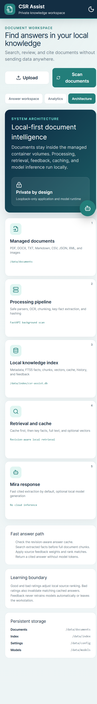

## Architecture overview

CSR Assist runs the React interface, FastAPI application, SQLite indexes,
document processors, OCR, and Ollama runtime in one local container. The
default network binding exposes only the application on loopback. Ollama is not
published to the host network.



## Data flow

1. Files enter the managed `/data/documents` volume through a bind mount or the
   validated upload endpoint.
2. Format-specific processors extract text from PDF, DOCX, TXT, Markdown, CSV,
   JSON, XML, and supported image formats.
3. The processing pipeline hashes files, skips unchanged content, chunks text,
   extracts sentence-level facts, and stores processed data in SQLite.
4. Retrieval checks the revision-aware answer cache, key-fact FTS5 index, full
   chunk FTS5 index, and optional vector index in that order.
5. Fast mode returns cited local evidence without model tokens. Generated mode
   sends bounded local evidence to an approved Ollama model.
6. Good and bad ratings adjust local source weights. A bad rating invalidates
   the matching cached answer.

## Persistent storage

| Container path | Purpose |
|---|---|
| `/data/documents` | Original managed documents |
| `/data/index` | SQLite documents, facts, history, cache, feedback, and usage |
| `/data/config` | Active model, model allowlist, and Mira persona |
| `/data/models` | Ollama manifests and model blobs |

The supplied Compose configuration bind-mounts documents, index data, and
configuration beneath the ignored local `data/` directory. Model blobs use a
named Docker volume.

## Retrieval layers

### Key-fact index

Sentence-level facts preserve their source document and chunk. FTS5 searches
facts before larger excerpts, reducing ranking noise and response construction
cost.

### Full-text index

Complete chunks remain in a second FTS5 index for broader matches and source
preview.

### Vector index

`nomic-embed-text` supplies 768-dimensional vectors through loopback-only
Ollama. Vector work begins only after an interactive idle period, preventing
background indexing from competing with searches and chat.

### Answer cache

The persistent cache key includes the normalized question, answer mode, active
model, corpus revision, and cache format version. Any document mutation
increments the corpus revision and removes stale answers.

## Security boundaries

* Document paths are confined beneath the managed root
* Symlinks, traversal names, unsupported extensions, and oversized files are
  rejected
* XML document type and entity declarations are rejected
* Uploaded names use a strict basename allowlist
* Ollama remains on `127.0.0.1` inside the container
* Browser security headers restrict scripts, connections, frames, and referrers
* Document instructions are treated as untrusted evidence
* Feedback never triggers automatic training or leaves the workstation

## Deployment topology

```text
Browser
  |
  | http://127.0.0.1:8080
  v
FastAPI + React static assets
  |-- Document processors and OCR
  |-- SQLite FTS5 + sqlite-vec
  |-- Answer cache, history, feedback, usage
  |
  | http://127.0.0.1:11434 (container only)
  v
Ollama local models
```
