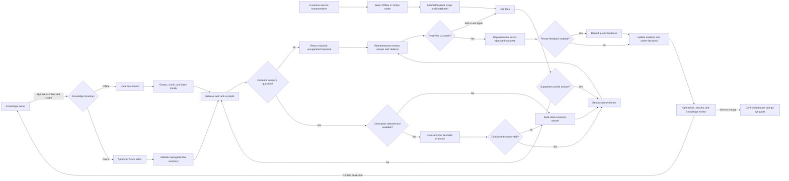
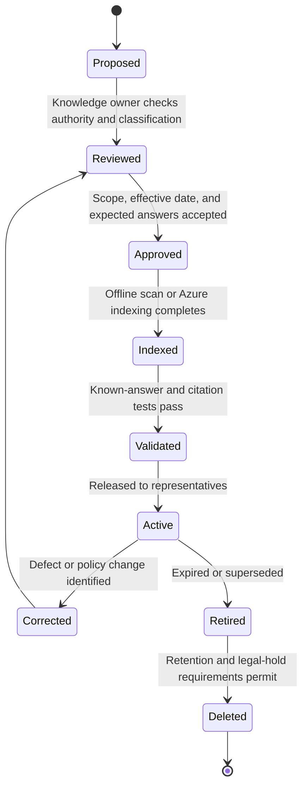

## End-to-end business flow

CSR Assist separates knowledge approval from answer generation. A knowledge
owner controls what can be searched. A representative controls the question,
reviews the evidence, and approves the final customer response.

## Business roles by stage

| Stage                | Accountable role              | Required evidence                                                       |
| ---                  | ---                           | ---                                                                     |
| Content approval     | Knowledge owner               | Approved source, owner, effective date, classification, expected answer |
| Index preparation    | Data or application operator  | Scan result, document count, chunk count, revision, errors              |
| Question and scope   | Representative                | Selected mode, grounding documents, model path, question                |
| Retrieval and answer | Application                   | Response state, model or fallback, citations, sources, cache state      |
| Customer response    | Representative                | Human-reviewed final text and required case record                      |
| Quality review       | Business and knowledge owners | Feedback, unsupported rate, citation defects, correction actions        |
| Operations           | Service and platform owners   | Health, latency, capacity, cost, revision, rollback readiness           |
| Security             | Security operations           | Sentinel posture, incidents, detections, investigation evidence         |

## Representative workflow

1. Confirm whether the question belongs to the Offline or Online knowledge
   boundary.
2. Select the relevant Azure grounding documents when Online scope must be
   narrower than the approved index.
3. In Offline mode, choose fast extractive retrieval or an available approved
   local model. In Online mode, choose an approved Foundry model; cited
   extraction remains a failure fallback.
4. Ask one focused question or select a business prompt.
5. Observe cache, retrieval, ranking, model, and citation-processing stages.
6. Read the answer and open each citation needed to verify that factual claims
   are supported. The application validates citation references, not the
   semantic truth of every generated claim.
7. Edit the draft for tone and case-specific information outside CSR Assist.
8. Send only after the response matches policy and the customer context.
9. Record feedback when the answer or evidence needs correction.

## Knowledge lifecycle

## Exception and escalation flow

| Condition                | Application behavior                                       | Business action                                                       |
| ---                      | ---                                                        | ---                                                                   |
| No relevant evidence     | Required unsupported response                              | Search a different approved source or escalate to the knowledge owner |
| Conflicting instructions | Cite conflicts without choosing authority                  | Knowledge owner resolves precedence                                   |
| Model unavailable        | Show model state or cited extractive fallback              | Continue with evidence or use approved workaround                     |
| Azure Search unavailable | Return an explicit service error                           | Hold Online work, communicate impact, and follow incident procedure   |
| Citation mismatch        | Replace generated text with cited extraction when possible | Mark bad feedback and investigate source or validator                 |
| Wrong source boundary    | Treat as a release-blocking security and quality incident  | Stop expansion and consider rollback                                  |
| Repeated rate limits     | Return retry guidance and create security telemetry        | Assess abuse, capacity, and user communication                        |
| Identity failure         | Return degraded service state and emit security telemetry  | Security and platform owners investigate RBAC or identity             |

## Decision controls

Mira can retrieve, summarize, and draft. It cannot:

* Approve a policy interpretation
* Select between conflicting authorities
* Add missing customer facts
* Commit an exception, refund, price, deadline, or contractual promise not
  supported by approved evidence
* Send a response to a customer

The representative remains the final business decision point. Knowledge,
security, compliance, and service owners retain authority for their respective
controls.
