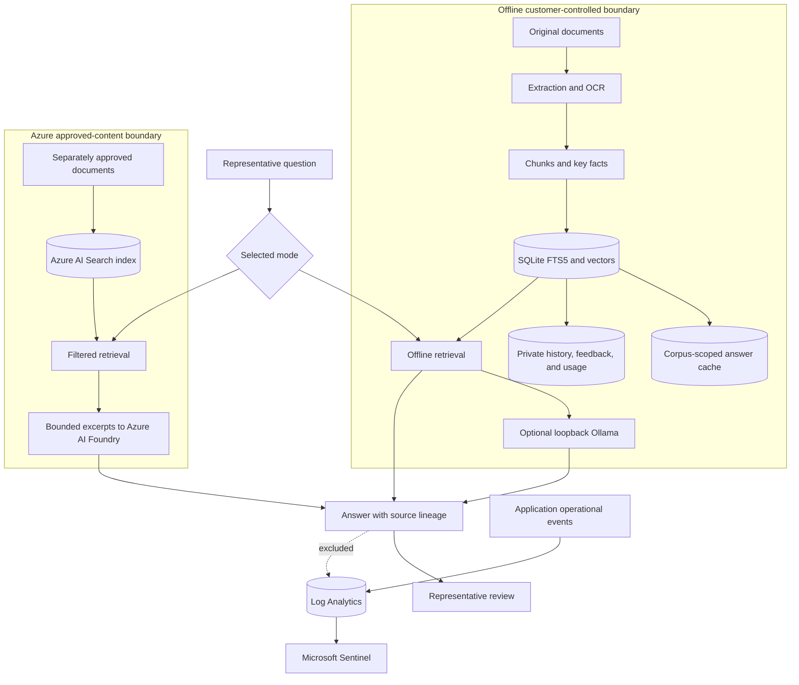

## Data architecture principles

CSR Assist uses source isolation, evidence minimization, explicit lineage, and
customer-controlled retention. Offline and Online data are separate products
of separate approval and indexing processes.

## Data domains

| Domain                 | Examples                                                          | System of record                                              | Business owner                  |
| ---                    | ---                                                               | ---                                                           | ---                             |
| Source knowledge       | Policies, procedures, product guidance, public samples            | Customer document repository or approved Azure source process | Knowledge owner                 |
| Derived retrieval data | Extracted text, chunks, key facts, vectors, document metadata     | Local SQLite or Azure AI Search                               | Knowledge and service owners    |
| Interaction data       | Questions, answers, citations, model path, response state         | Private SQLite history when enabled                           | Service owner                   |
| Quality data           | Good or bad feedback, cache invalidation, expected-answer results | Private SQLite and test evidence                              | Business and knowledge owners   |
| Usage data             | Request counts, latency, cache hits, token estimates              | SQLite analytics                                              | Service owner                   |
| Operational telemetry  | Health, revision, console and system events                       | Container platform and Log Analytics                          | Platform operations             |
| Security telemetry     | Rate limits, server errors, identity failures, Sentinel incidents | Log Analytics and Microsoft Sentinel                          | Security operations             |
| Configuration          | Allowlisted models, persona, endpoints, source mode settings      | Environment and local configuration storage                   | Application and platform owners |

## Data classification

Final classification follows customer policy. This baseline supports planning:

| Data                                     | Baseline classification     | Handling requirement                                             |
| ---                                      | ---                         | ---                                                              |
| Public sample documents                  | Public                      | Preserve attribution and non-authoritative notice                |
| Internal policies and procedures         | Internal or confidential    | Restrict document, index, backup, and operator access            |
| Customer questions and case context      | Confidential                | Minimize content, restrict history, and apply case-system policy |
| Retrieved excerpts and generated answers | Same as source or higher    | Protect as source-derived customer-service content               |
| Identity and access configuration        | Confidential                | Use managed identity and avoid stored credentials                |
| Aggregated usage metrics                 | Internal                    | Restrict operational access and retention                        |
| Hashed short-term client identifiers     | Internal security telemetry | Use for correlation only, not durable identity                   |
| Access tokens and identity headers       | Secret                      | Never log, persist, return, or commit                            |

## Data lineage

Every cited result should preserve:

* Source channel: Offline or Online
* Document and chunk identifiers
* Name and relative path
* Location within the source
* Native, OCR, or structured extraction method
* Keyword, semantic, hybrid, or Azure Search retrieval path
* Source URL for approved public or Online content when available

An answer adds the selected model or extractive fallback, cache state, response
state, numbered citations, and history identifier when private history is
enabled.

## Offline processing

1. The scanner discovers files under the configured documents directory.
2. Filename and path validation confine access to the approved root.
3. Supported files are extracted natively, through OCR, or as structured
   content.
4. Text is divided into bounded chunks and key facts.
5. SQLite stores document metadata, chunks, FTS5 data, vectors, history,
   feedback, usage, and answer cache entries.
6. Corpus revision changes invalidate stale cached answers.
7. Fast retrieval uses indexed facts and excerpts. Optional Ollama calls remain
   on the loopback interface.

## Online processing

1. An administrator separately approves and indexes content in Azure AI Search.
2. CSR Assist lists distinct approved documents from filterable index fields.
3. The representative may select up to 50 document identifiers.
4. The backend applies document filters server-side.
5. Azure AI Search receives the question and returns bounded matching excerpts.
6. Azure AI Foundry receives the question and no more than the selected
   retrieved evidence required for generation.
7. Citation-reference validation rejects missing or invalid citation markers
   and uses a cited extractive fallback when sufficient evidence exists.
   Representatives remain responsible for confirming that claims match the
   cited text.

## Storage and retention matrix

| Data store                    | Data                                  | Default or current setting      | Production decision                            |
| ---                           | ---                                   | ---                             | ---                                            |
| `/data/documents`             | Original Offline files                | Persistent Docker mount         | Retention, backup, deletion, malware scanning  |
| `/data/index`                 | SQLite retrieval and interaction data | Persistent Docker mount         | Encryption, backup, retention, recovery        |
| `/data/config`                | Editable local settings               | Persistent Docker mount         | Change control and backup                      |
| `/data/models`                | Local model files                     | Named Docker volume             | Approved models, patching, capacity            |
| Azure AI Search               | Approved Online chunks and metadata   | Customer-managed index          | Residency, retention, deletion, private access |
| Azure AI Foundry              | Bounded generation requests           | Service configuration dependent | Region, abuse monitoring, contract, retention  |
| Log Analytics                 | Operational and security events       | 30 days in current demo         | Cost, retention, archive, access               |
| Microsoft Sentinel            | Incidents and detections              | Workspace-backed                | Incident retention and case integration        |
| Container App ephemeral paths | Demo runtime data                     | Removed with replica lifecycle  | Do not use for required business records       |

## Data quality controls

| Control                        | Purpose                                                   |
| ---                            | ---                                                       |
| Approved document manifest     | Establish authority, owner, version, and scope            |
| Scan and index status          | Surface unsupported files and extraction errors           |
| Known-answer probes            | Verify representative high-value questions                |
| Unsupported-answer probes      | Prevent external-knowledge substitution                   |
| Conflict probes                | Identify contradictory source instructions                |
| Citation-reference validation  | Require generated answers to reference retrieved evidence |
| Representative citation review | Confirm that factual claims match the cited source text   |
| Selected-document probes       | Prove Online server-side scope filtering                  |
| Corpus revision cache keys     | Prevent answers from surviving source changes             |
| Bad-feedback invalidation      | Remove a rejected cached answer                           |

## Data deletion and subject requests

CSR Assist does not implement an enterprise data-subject-request workflow.
Customers must map identities and case records through their authoritative
systems. Deletion planning should include original documents, derived chunks,
vectors, cache entries, history, feedback, backups, Azure Search records,
platform logs, Sentinel incidents, and legal holds.

Follow the [security architecture](./SECURITY-ARCHITECTURE.md) for trust
boundaries and the [business requirements](./BUSINESS-REQUIREMENTS.md) for
data acceptance criteria.
