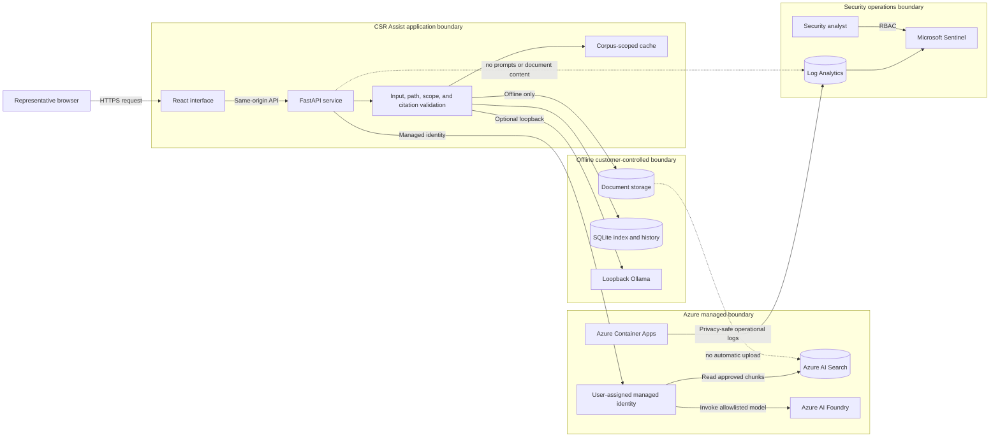

## Security objectives

CSR Assist protects source boundaries, evidence integrity, customer content,
service availability, and Azure identities. Its primary security objective is
to prevent an unapproved source, model, caller, or document instruction from
becoming an authoritative customer response.

## Trust-boundary diagram

## Security control layers

### Knowledge and model controls

* Offline and Online indexes remain isolated.
* Online document identifiers are bounded and applied as server-side filters.
* Models must be allowlisted and available before invocation.
* Instructions contained inside documents are treated as untrusted content.
* Generation prompts require evidence-only answers and numbered citations.
* Citation-reference validation detects missing or invalid source markers and
  replaces unusable generation with cited extraction when evidence remains
  sufficient.
* Representatives verify that generated claims are semantically supported by
  the cited text before sending a response.
* Missing evidence produces the required unsupported response.

### Application controls

* Request models bound message, model, filename, and document-selection input.
* Path confinement and filename validation prevent traversal.
* Read-only demo mode rejects mutation.
* Route-specific rate limits protect chat, search, scan, and upload.
* Security headers restrict framing, content types, referrers, and content
  sources.
* Errors return explicit unavailable or degraded states.
* Cache keys include source mode, model, selected documents, and corpus
  revision.

### Identity and platform controls

* Azure access uses a user-assigned managed identity.
* Azure AI Search access uses data-reader permission.
* Azure AI Foundry access uses the approved invocation role.
* Log Analytics and Sentinel access is read-only for the application identity.
* Immutable image tags and Container Apps revisions support rollback.
* The local model runtime listens on loopback inside the container.
* Production owners remain responsible for network isolation, private
  endpoints, firewall policy, encryption, patching, and backup.

### Monitoring and response controls

Microsoft Sentinel receives Container Apps console and system events. CSR
Assist emits bounded `CSR_SECURITY` events for:

* API rate-limit rejection
* Server responses with status 500 or higher
* Managed-identity or Azure authorization failure

The application does not put prompts, answers, citations, document names,
document content, tokens, or raw client addresses in security events.

Scheduled Sentinel detections cover rate-limit surges, server-error spikes,
and managed-identity failures. The Security workspace exposes incidents,
rules, ingestion freshness, error rate, revisions, replicas, hourly trends,
and common platform signals.

## Threat and control matrix

| Threat                                   | Business impact                        | Preventive control                                              | Detective or recovery control                    |
| ---                                      | ---                                    | ---                                                             | ---                                              |
| Prompt or document instruction injection | Unapproved action or misleading answer | Evidence-only persona, untrusted-document rule, bounded prompts | Citation review and bad feedback                 |
| Cross-boundary retrieval                 | Confidentiality or policy-scope breach | Separate clients, indexes, modes, and filters                   | Boundary probes and security incident            |
| Unsupported model knowledge              | Incorrect customer commitment          | Retrieval support threshold and citation validator              | Extractive fallback or unsupported response      |
| Path traversal or unsafe upload          | Unauthorized file access               | Confined paths, filename validation, size and type controls     | Explicit upload error and audit evidence         |
| Credential exposure                      | Azure resource compromise              | Managed identity and no stored Azure keys                       | Identity-failure detection and secret scanning   |
| Excessive requests                       | Cost, latency, or availability impact  | Route rate limits and bounded context                           | Sentinel rate-limit surge detection              |
| Model or Azure outage                    | Delayed customer response              | Fast retrieval path and cited fallback                          | Health checks, degraded state, rollback          |
| Stale cached answer                      | Superseded policy response             | Corpus-revision and selected-scope cache keys                   | Bad-feedback invalidation and known-answer tests |
| Log data leakage                         | Confidential data in security tools    | Privacy-safe event schema                                       | Workspace review and retention governance        |
| Unauthorized security changes            | Disabled monitoring or hidden incident | Read-only runtime identity                                      | Azure Activity Log and change control            |
| Malicious or obsolete source             | Incorrect guidance                     | Knowledge-owner approval and manifest                           | Citation defects, content review, retirement     |
| Supply-chain compromise                  | Altered application or dependency      | Locked dependencies and controlled image build                  | Image revision evidence and rollback             |

## Responsibility model

| Control area                         | Application team | Platform or security owner | Knowledge or business owner              |
| ---                                  | ---              | ---                        | ---                                      |
| Retrieval and citation validation    | Responsible      | Consulted                  | Accountable for expected answer          |
| Document approval and classification | Consulted        | Consulted                  | Accountable                              |
| Managed identity and RBAC            | Consulted        | Accountable                | Informed                                 |
| Network isolation and private access | Informed         | Accountable                | Informed                                 |
| Data retention and legal hold        | Consulted        | Responsible                | Privacy and compliance is accountable    |
| Platform backup and recovery         | Consulted        | Accountable                | Knowledge or business owner is consulted |
| Sentinel detection engineering       | Consulted        | Accountable                | Informed                                 |
| Customer-response approval           | Informed         | Informed                   | Representative is accountable            |
| Incident containment and rollback    | Responsible      | Accountable                | Consulted                                |

## Security acceptance evidence

Before production expansion, retain evidence that:

1. Offline and Online boundary probes pass.
2. Selected Azure document filters return only approved IDs.
3. Managed identity has no broader role than required.
4. Unsupported, conflicting, and malicious-instruction questions behave as
   designed.
5. Security headers and route limits are active.
6. Sentinel ingestion is fresh and required analytic rules are enabled.
7. A controlled alert reaches the incident workflow.
8. Security telemetry contains no prompt, answer, citation, or document text.
9. The prior healthy revision can receive traffic.
10. Open risks have named owners and approved deadlines.

Follow the [Sentinel operations guide](./SECURITY-OPERATIONS.md) for monitoring
and the [Day 2 go-live plan](./GO-LIVE-PLAN.md) for incident and rollback
execution.
