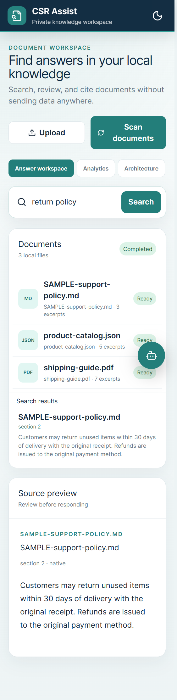
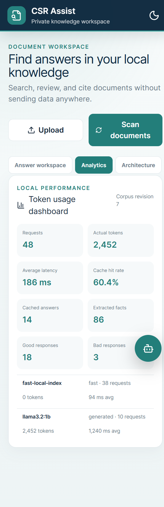
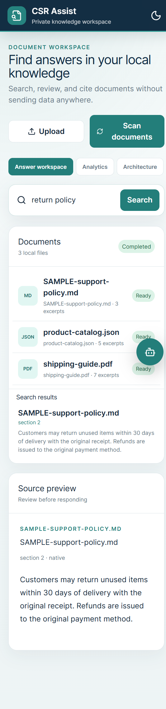

## Navigate the workspace

The primary navigation contains four sections:

* **Answers** searches sources and previews exact excerpts.
* **Analytics** reports request, latency, cache, token, and feedback metrics.
* **Architecture** describes document processing and response flows.
* **Compliance** shows the data boundary and customer responsibilities for the
  selected Online or Offline mode.

All four sections remain visible in a two-column grid on small screens. The
header displays the active Online or Offline mode, and the **Ask Mira** button
opens the mobile assistant.

### Follow the guided demo

Select **How to use** in the top-right header, next to the environment selector
or active environment badge. On small screens, the same control appears as a
compact help icon. The interactive tour introduces the workspace in five
steps:

1. Choose an environment. The tour highlights the Docker or Azure preview in
   the public demo, or the active Online or Offline environment badge in other
   deployments.
2. Confirm the knowledge boundary. The source notice identifies which content
   the selected environment can search and keeps Online and Offline sources
   separate.
3. Search and review evidence. The tour points to document search, where you
   can enter a question or keyword and inspect matching excerpts.
4. Explore the workspace panels. The navigation provides Answers, Analytics,
   Architecture, and Compliance views for evidence, usage, model and cost
   details, and data-boundary responsibilities.
5. Ask Mira. The assistant provides the available model selector, estimated
   token cost, suggested prompts, and grounded question composer.

Use **Next** to advance and **Back** to revisit a step. **Back** is unavailable
on the first step. On the final step, **Finish** replaces **Next**. Select
**Skip tour**, use the close button, or press Escape to leave the tour at any
time. When the tour closes, keyboard focus returns to the **How to use**
control.

The tour highlights the visible version of each target and scrolls it into
view. This behavior lets the same steps follow the desktop workspace or the
responsive mobile layout without opening hidden controls.

> [!NOTE]
> The guided demo is read-only. It does not submit questions, switch
> environments, move documents, or change stored data. It only explains and
> highlights controls.

## Answers



Answers is the default section. It loads document and scan status
before secondary model, history, and analytics data.

1. Enter a phrase in **Search documents**.
2. Review ranked results in the document card.
3. Select a result to inspect the exact processed excerpt.
4. Use **Upload** for one file or **Scan documents** to reconcile the mounted
   directory.

Search progress reports cache, key-fact, full-excerpt, ranking, and citation
phases while work is pending.

### Public demo behavior

The
[hosted Azure demo](https://ca-csr-assist-demo.salmondesert-76e2a623.westus2.azurecontainerapps.io/)
uses only bundled public samples. Do not enter private, confidential, personal,
or regulated information. The demo does not accept uploads, persist search or
chat history, accept feedback, or allow model or settings changes. Its runtime
documents, indexes, configuration, and model directories are ephemeral. A
scale-from-zero cold start can delay the first request after an idle period.

Use the public-demo controls to preview each environment:

1. In **Environment preview**, select **Docker** for the on-premises path or
   **Azure** for the cloud path.
2. Open **Ask Mira** and find the environment-aware model list. It is labelled
   **Docker LLM model** or **Azure LLM model** based on your preview.
3. Select an available model, or use **Fast local index (no LLM)** in the
   Docker preview, then ask your question.

The Docker model list contains the approved Ollama models. Only models already
installed in Docker are enabled; approved models that are not installed appear
as **Setup required** and cannot be selected. **Fast local index (no LLM)**
returns a cited extractive answer without calling an LLM.

The Azure model list contains only Foundry deployments configured and
allowlisted by the server. The current public Azure deployment exposes
**Phi-4-mini** only. Access to **GPT-4o-mini** was denied for this subscription,
so the interface does not present it as a broken option.

The environment preview also chooses the processing boundary:

* **Offline** searches the bundled local index and returns cited extracted
  content.
* **Online** searches the managed Azure AI Search index and uses Azure AI
  Foundry to generate a grounded answer from the retrieved excerpts.

The interface labels results and citations as Online or Offline. Online mode
sends the question to Azure AI Search, then sends the question and bounded
public demo excerpts to Azure AI Foundry.

Offline uses a teal visual boundary. Online switches the workspace to Azure
blue. Labels and badges accompany the colors. Changing the selector never
uploads or synchronizes Offline documents. Offline files are not searchable
Online unless an administrator separately approves and indexes content in
Azure AI Search. Azure-indexed sources are unavailable Offline.

Offline mode displays local upload and scan controls plus the local document
inventory. Online mode replaces them with a managed-index notice and shows
only Azure AI Search results. This prevents local files from appearing as
available Online sources.

## Ask Mira

Open Mira from the desktop assistant panel or the floating mobile button. The
clean header identifies **Mira AI Assistant** as grounded and keeps the current
document context close to the conversation.

The compact **Knowledge source** area shows **Offline** with the local index or
**Online** with Azure AI. Use its source toggle to change modes. The boundary
notice explains which sources Mira can use, and the composer placeholder
changes to match the selected context. Offline mode also provides optional
local model settings. Online mode identifies the active Azure AI Foundry
model.

Use the assistant navigation to switch between **Chat** and **History**:

1. Open **Chat** to ask a question or start from the prompt gallery.
2. Choose **Suggested prompts** for the three common tasks or **All prompts**
   for the complete gallery. **Browse prompt gallery** also opens the complete
   list.
3. Select a prompt to place its text in the large composer at the bottom of
   the assistant. You can review or edit the text before sending it.
4. Select the send button to ask Mira. The button remains unavailable until
   the composer contains text.

Suggested prompts include:

* What is the return policy?
* Draft a customer-ready response
* Are there conflicting instructions?

The complete gallery also includes prompts for summaries, source support, and
missing information. Mira keeps the composer at the bottom of **Chat** while
you review prompts and answers.

The optional local model selector controls generated Offline answers. Models
marked **Setup required** are approved but not installed.

### Review the selected-model cost

The model selector includes a cost summary for the current choice:

* **Fast local index (no LLM)** reports no LLM token charge.
* A selected Docker model reports a $0 provider-token charge.
* A selected Online model reports its estimated request cost and its input and
  output rates in USD per 1 million tokens.

The estimate assumes 2,000 input tokens and 120 output tokens. For the current
Azure AI Foundry **Phi-4-mini** deployment, the planning rates as of 2026-10-06
are $0.075 per 1 million input tokens and $0.300 per 1 million output tokens:

```text
((2,000 input tokens x $0.075) + (120 output tokens x $0.300)) / 1,000,000
= approximately $0.000186 per request
```

The **Architecture** tab provides the full Online and Offline LLM token cost
matrix. It also identifies the current **West US 2** Azure resources and their
billing basis:

| Service | Resource | SKU and billing |
|---|---|---|
| Azure Container Apps | `ca-csr-assist-demo` | Consumption; billed for vCPU, memory, and requests |
| Azure AI Search | `srch-csr-assist-kvenk26` | Free SKU; billed by provisioned capacity, not tokens |
| Azure AI Foundry | `aif-csr-assist-kvenk26` | AIServices S0; model input and output token billing |

The Docker $0 amount covers provider tokens only. It excludes hardware,
electricity, hosting, support, and operations. Container Apps and Azure AI
Search charges are also separate from the Foundry token estimate.

> [!IMPORTANT]
> Rates and request costs are estimates, not invoices or guarantees. Actual
> charges may vary by currency, contract, region, taxes, discounts, model
> version, and usage. Verify the deployment and current rates in the
> [Azure pricing calculator](https://azure.microsoft.com/pricing/calculator/).
> This cost information does not certify compliance and does not provide legal
> advice.

Mira does not use external knowledge or speculate beyond retrieved excerpts.
When the documents do not support an answer, Mira responds:

> I’m unable to answer this question because it falls outside the scope of the
> provided documents or is not supported by their content.

### Online generation and fallback

Online generation calls the Foundry deployment named in
`CSR_AZURE_AI_FOUNDRY_DEPLOYMENT` through its deployment-specific endpoint.
Each generation attempt is bounded to 10 seconds.

If Foundry is rate limited, temporarily unavailable, times out, or returns no
usable response, Mira displays a cited extractive answer from the Azure AI
Search results and identifies it with a fallback notice. Mira uses the same
fallback for a Foundry refusal or uncited answer only when the retrieved
sources strongly support the question. Otherwise, Mira returns the standard
unsupported response.

## Data Compliance tab

Open **Data Compliance** after selecting a source mode. The content changes
with the active boundary:

* **Implemented** identifies application-enforced behavior
* **Boundary** identifies a local, Azure, or transfer boundary
* **Customer control** identifies a decision or operational safeguard the
  customer must configure
* **Verify** identifies evidence that must be completed before a production or
  conformance claim

Offline mode documents local parsing, SQLite FTS retrieval, optional Ollama,
and local cache, history, feedback, and usage storage. It also identifies the
customer's responsibility for document classification, host access, disk
encryption, backups, malware scanning, retention, deletion, recovery, patching,
auditing, and incident response.

Online mode documents the approved Azure AI Search index, search-query
transfer, bounded excerpt and question transfer to Foundry, managed identity
and RBAC, Azure index persistence until customer deletion, and Offline-source
isolation. The customer must decide and verify the Azure region, residency,
retention, diagnostic logging, networking, encryption, deletion, legal-hold,
and incident-response configuration.

The accessibility section references
[CAN/ASC EN 301 549:2024 Section 11](https://accessible.canada.ca/standards-and-technical-guides/standards-and-technical-guides-database/can-asc-en-301-5492024-accessibility-requirements-ict-products-and-services-en-301-5492021-idt/11-software).
Its checks are implementation documentation and a release verification list.
They are not accessibility certification, a compliance or conformance
determination, or legal advice.

## Improve retrieval with feedback

Use the thumbs-up or thumbs-down controls below an answer.

* A good rating increases the ranking weight of cited source chunks.
* A bad rating decreases their weight and invalidates the matching cache entry.
* Changing a rating reverses the previous weight before applying the new one.
* Ratings remain local and do not retrain a model automatically.

## History

Open Mira's **History** tab to view locally stored searches and questions. The
tab shows the current entry count. Selecting an item restores its query and
returns you to **Chat**, where you can review or edit it before sending.
**Clear history** deletes the conversation and search history from SQLite.

## Analytics



The Analytics tab loads only when selected. It reports:

* Request and cache-hit counts
* Actual prompt and output tokens
* Average latency
* Cached answers and extracted facts
* Good and bad response totals
* Per-model and per-mode usage

Fast local-index answers correctly report zero tokens.

## Mobile interface



The responsive layout places documents and source preview in one column.
Open Mira with the floating assistant button.

## Supported files

| Format | Processing |
|---|---|
| PDF | Native page text with OCR fallback |
| DOCX | Paragraph extraction |
| TXT and Markdown | UTF-8 text |
| CSV | Row and column text |
| JSON | Searchable field paths and values |
| XML | Searchable element paths, attributes, and values |
| PNG, JPEG, TIFF | Tesseract OCR |

Original files remain in `/data/documents`. Search and chat use processed
SQLite facts, chunks, and vectors rather than reparsing documents per request.
Cache entries, search and chat history, feedback, and usage records remain in
the local SQLite database under `/data/index`. Optional Ollama requests stay
inside the local application environment.
